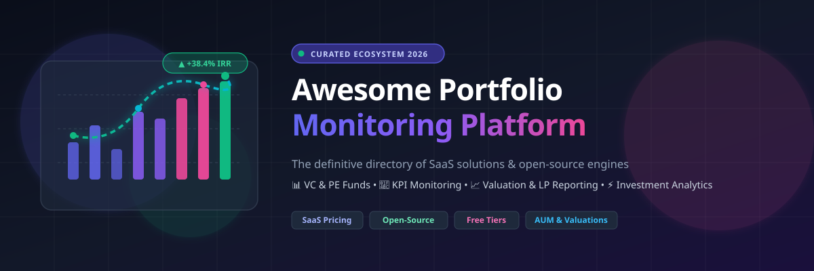

# 🚀 Awesome Portfolio Monitoring Platform 📊

**Curated ecosystem of SaaS software, open-source analytics engines, fund performance calculators, and self-hosted tools for Venture Capital, Private Equity, Family Offices, and Investment Teams.**

[🌟 Star on GitHub](https://github.com/ishandutta2007/Awesome-Portfolio-Monitoring-Platform) • [💬 Join Discord](https://discord.gg/jc4xtF58Ve) • [🤝 Contribute](#-how-to-contribute) • [📑 Table of Contents](#-table-of-contents)

---

## 📖 Overview & Ecosystem Summary

This repository is the definitive reference directory tracking leading **SaaS platforms** and **open-source tools** in the **Portfolio Monitoring Platform** ecosystem. These tools empower investment funds, venture capital firms, private equity managers, family offices, asset managers, and fund administrators to:

* 📊 **Monitor Portfolio Companies & Real-time KPIs**: Collect operational, financial, and product metrics seamlessly.
* 📈 **Analyze Fund Performance & Metrics**: Compute IRR, MOIC, DPI, TVPI, RVPI, NAV, and historical drawdown analytics.
* 💼 **Cap Table & Valuation Operations**: Track ownership, 409A valuations, waterfalls, and dilution models.
* 📜 **LP Reporting & Investor Relations**: Generate institutional-grade investor updates, quarterly reports, and interactive investor portals.
* ⚡ **Open-Source & Self-Hosted Financial Data Pipelines**: Build modular, privacy-first portfolio monitoring platforms with SQL, Python, double-entry accounting, and modern BI dashboards.

---

## 📑 Table of Contents

* [🏢 SaaS & Hosted Commercial Platforms](#-saas--hosted-commercial-platforms)
* [💻 Open-Source GitHub Projects](#-open-source-github-projects)
* [🧩 Additional Modular Open-Source Components](#-additional-modular-open-source-components)
* [📈 Star History](#-star-history)
* [🤝 How to Contribute](#-how-to-contribute)
* [⚖️ Disclaimer](#️-disclaimer)

---

## 🏢 SaaS & Hosted Commercial Platforms

> 💡 **Market Overview & Structure**: The global alternative investment management and portfolio monitoring software market is estimated at **$4.5B–$6.0B** (projected to reach **$10B+ by 2030** at ~12% CAGR). The sector is **moderately fragmented**: institutional accounting and administration remain dominated by incumbent titans (*FIS*, *SS&C*), while middle-office portfolio monitoring, dealflow CRM, and VC/growth KPI analytics exhibit vibrant competition with category leaders (*Carta*, *Addepar*, *Juniper Square*, *DealCloud*) capturing specialized segments alongside nimble modern platforms (*Visible.vc*, *Vestberry*, *Fundwave*).

| Platform | Valuation / Revenue Scale (Desc) | Description | Pricing (Starting Tier) | Free Tier / Trial Limits |
| :--- | :--- | :--- | :--- | :--- |
| **FIS Investran** | **~$14.5B Revenue** (FIS Global parent, ~$45B+ Market Cap) | Institutional investment accounting and administration platform widely used for private equity, venture capital, real estate, and alternative investment funds. | Custom enterprise licensing (typically starting around ~$50,000–$100,000+/year based on fund structures and implementation) | No free tier; enterprise demonstration on request |
| **FIS Front Arena** | **~$14.5B Revenue** (FIS Global parent, ~$45B+ Market Cap) | Capital markets platform supporting trading, portfolio risk, valuation, analytics, and investment operations. | Custom enterprise licensing (institutional deployments typically starting at $100,000+/year) | No free tier; formal evaluation sandbox on request |
| **SS&C Advent** | **~$5.5B Revenue** (SS&C Technologies, ~$18B Market Cap) | Investment management and accounting technology covering portfolio accounting, performance measurement, reporting, and institutional investment operations. | Custom enterprise quotes (Geneva / APX deployments typically start at $40,000–$75,000+/year) | No free tier; institutional demo upon request |
| **Carta** | **~$7.4B Valuation** (~$350M+ ARR) | Equity and private-markets platform supporting cap table management, valuations, fund administration, portfolio monitoring, and investor operations. | Free tier available; paid plans start at ~$3,000/year (Build/Scale tiers scale with cap table stakeholder count) | **Carta Launch Plan**: 100% Free for early-stage companies up to $1M raised and up to 25 stakeholders/security holders |
| **DealCloud** | **~$3.0B Valuation** (Intapp subsidiary, ~$3.5B Market Cap, ~$450M Rev) | Financial-services relationship and deal management platform that can support investment pipeline tracking, portfolio intelligence, and relationship analytics. | Custom enterprise quotes (starts around ~$85,000/year for institutional mid-market deployments) | No free tier; customized demo upon request |
| **Addepar** | **~$2.17B Valuation** (~$170M+ ARR, $5T+ assets tracked) | Investment portfolio management and reporting platform focused on complex wealth, multi-asset portfolios, data aggregation, and performance analytics. | Custom enterprise pricing (scaled by AUM; typically starts around $30,000–$50,000/year base) | No free tier; custom demonstration upon request |
| **eFront** | **~$1.43B Valuation** (Acquired by BlackRock / Aladdin) | Alternative investment management platform supporting private markets, portfolio management, valuations, risk analysis, accounting, and investor reporting. | Custom enterprise quotes (institutional packages typically start at $50,000+/year) | No free tier; institutional demo upon request |
| **Juniper Square** | **~$1.2B Valuation** (~$75M+ ARR, $1T+ equity managed) | Private-markets fund operating platform supporting fundraising, investor management, fund administration, portfolio monitoring, accounting, and LP reporting. | Starts at ~$18,000/year (Sponsor tier base subscription; scales with AUM and fund administration add-ons) | No free tier; custom demo upon request |
| **Enfusion** | **~$850M Market Cap** (~$180M Revenue) | Cloud-native investment management platform combining portfolio management, order management, risk, accounting, and investment operations. | Custom SaaS pricing (institutional portfolio setups typically start at $30,000–$60,000+/year) | No free tier; live platform demo on request |
| **Allvue** | **~$800M+ Valuation** (Vista Equity Partners backing) | Investment management technology platform supporting portfolio management, fund accounting, reporting, structured products, credit, and alternative investments. | Custom enterprise quotes (entry implementations typically range from ~$25,000–$50,000+/year based on modules) | No free tier; demo available on request |
| **Affinity** | **~$600M Valuation** (~$40M+ ARR) | Relationship intelligence platform used by venture capital, private equity, and investment organizations for relationship management and investment workflows. | Starts at ~$2,000/user per year (~$167/user/month billed annually) for Essential tier | No free tier; personalized demo on request |
| **Dynamo Software** | **~$350M+ Valuation** (Francisco Partners backing) | Alternative investment management platform supporting deal management, portfolio monitoring, investor relations, fund administration, and investment reporting. | Custom enterprise quotes (typically starts around ~$20,000–$35,000/year depending on user seats and modules) | No free tier; sales demo on request |
| **Backstop Solutions** | **~$200M+ Valuation** (ION Group subsidiary) | Cloud-based investment management platform providing portfolio, research, CRM, investor relations, and analytics capabilities for institutional investment organizations. | Custom institutional pricing (typically starts at ~$15,000–$25,000/year based on activated modules and user count) | No free tier; customized product demo on request |
| **iLEVEL** | **~$150M+ Valuation** (S&P Global Capital IQ Solutions) | Portfolio monitoring and reporting technology focused on private capital managers, portfolio company data collection, performance monitoring, and investor reporting. | Custom institutional contracts (typically starting around £36,000 / ~$45,000+/year depending on asset scale) | No free tier; managed demo upon request |
| **Altvia** | **~$100M+ Valuation** (~$20M ARR, Bow River Capital backing) | Salesforce-native private capital software platform supporting investor relations, fundraising, portfolio management, fund workflows, and LP communications. | Custom pricing based on Salesforce user licenses (typically starting around ~$12,000–$24,000/year) | No free tier; tailored product demo upon request |
| **Chronograph** | **~$80M+ Valuation** (Carlyle & Nasdaq Ventures backing) | Private equity portfolio analytics and monitoring platform focused on investment performance, fund metrics, portfolio company analysis, and reporting. | Custom enterprise pricing (typically starting around $25,000–$50,000+/year based on portfolio company count) | No free tier; guided platform walkthrough on request |
| **Cobalt** | **~$60M+ Valuation** (FactSet portfolio solution) | Investment data and portfolio reporting technology supporting alternative investment monitoring, fund administration, analytics, and institutional reporting. | Custom enterprise licensing (typically starting at $20,000+/year) | No free tier; enterprise trial/demo by consultation |
| **FundCount** | **~$35M+ Valuation** (Bootstrap / Profitable growth) | Investment accounting and partnership accounting platform supporting complex fund structures, portfolio accounting, reporting, and family-office workflows. | Starts at $4,000/year (HNW individual/1 user) or $14,450/year (Fund Admin Incubator tier) | No free tier; interactive demonstration upon request |
| **Vestberry** | **~$25M Valuation** (~$4M ARR) | Private-market portfolio monitoring and reporting platform supporting investment analytics, valuations, portfolio KPIs, and fund performance analysis. | Custom quote-based pricing (entry-level fund subscriptions typically start around €10,000–€15,000/year) | 14-day free trial available for qualified venture & PE funds upon evaluation request |
| **Visible.vc** | **~$20M Valuation** (~$3.5M ARR) | Portfolio monitoring and investor reporting platform focused on startup KPIs, portfolio company updates, data collection, and venture capital reporting workflows. | Free tier available; paid plans start at $59/month ($708/year billed annually) for Base tier | **Starter Plan**: Free forever with up to 100 investor contacts, 2 pitch decks, 2 pipelines, and basic KPI dashboard |
| **SatuitCRM** | **~$15M Valuation** (Tier1 Financial Solutions subsidiary) | CRM and investor relationship management platform for investment firms, asset managers, private equity organizations, and alternative investment managers. | Starts at $150/user per month ($1,800/user/year) for Satuit Essentials tier | No permanent free tier; trial/demo sandbox on request |
| **Fundwave** | **~$10M Valuation** (~$2M ARR) | Private equity and venture capital fund administration platform covering portfolio monitoring, accounting, investor reporting, and fund operations. | Starts at $1,400/month (~$6,000 to $16,800/year depending on modules/AUM tier) | No permanent free tier; guided interactive demo available |

---

## 💻 Open-Source GitHub Projects

An expanding ecosystem of production-grade open-source applications, quantitative analytics libraries, self-hosted dashboards, and double-entry accounting engines for building custom portfolio monitoring infrastructure. Repositories are ranked by community GitHub_Stars.

### 🔹 [Grafana](https://github.com/grafana/grafana) \n\nOpen-source analytics and interactive visualization platform for real-time portfolio KPI monitoring, time-series metrics, and operational performance dashboards.\n\n### 🔹 [Apache Superset](https://github.com/apache/superset) \n\nModern enterprise-ready business intelligence web application ideal for building portfolio company KPI dashboards, investment metrics, and LP reports.\n\n### 🔹 [PostHog](https://github.com/PostHog/posthog) \n\nOpen-source product analytics suite widely deployed across venture-backed portfolio companies for tracking product KPIs, retention, and growth metrics.\n\n### 🔹 [Metabase](https://github.com/metabase/metabase) \n\nEasy-to-use open-source business intelligence and visualization tool for creating self-hosted portfolio analytics dashboards, KPI queries, and alerts.\n\n### 🔹 [Apache Airflow](https://github.com/apache/airflow) \n\nPlatform to programmatically author, schedule, and monitor workflows, ideal for automating periodic portfolio data extraction, KPI collection, and report generation.\n\n### 🔹 [Maybe](https://github.com/maybe-finance/maybe) \n\nOpen-source personal finance and wealth management platform for tracking investments, net worth, assets, and future financial planning.\n\n### 🔹 [OpenBB Platform](https://github.com/OpenBB-finance/OpenBB) \n\nOpen-source financial data and analytics platform for custom portfolio monitoring, market research, equity valuation, risk management, and quantitative workflows.\n\n### 🔹 [ClickHouse](https://github.com/ClickHouse/ClickHouse) \n\nFast open-source column-oriented database management system for real-time analytical reporting, tick data, time-series KPIs, and large portfolio logs.\n\n### 🔹 [DuckDB](https://github.com/duckdb/duckdb) \n\nHigh-performance in-process analytical database engine optimized for complex analytical queries on financial datasets, portfolio telemetry, and Parquet data.\n\n### 🔹 [Airbyte](https://github.com/airbytehq/airbyte) \n\nLeading open-source data integration platform with 300+ connectors to sync financial APIs, CRM records, and portfolio company databases into unified data stores.\n\n### 🔹 [Ghostfolio](https://github.com/ghostfolio/ghostfolio) \n\nOpen-source wealth management platform to track stocks, ETFs, and crypto across multiple accounts with automated portfolio breakdown and privacy-first design.\n\n### 🔹 [ERPNext](https://github.com/frappe/erpnext) \n\nOpen-source ERP system customizable for investment operations, portfolio company KPI collection, SPV workflows, fund accounting, and multi-entity books.\n\n### 🔹 [Yahoo Finance (yfinance)](https://github.com/ranaroussi/yfinance) \n\nWidely-used Python library to download historical market data, company financials, and valuation metrics for portfolio analysis.\n\n### 🔹 [Prefect](https://github.com/PrefectHQ/prefect) \n\nWorkflow orchestration engine designed to build, observe, and react to data pipelines for portfolio KPI aggregation, valuation pipelines, and LP notifications.\n\n### 🔹 [Cube.js](https://github.com/cube-js/cube) \n\nOpen-source universal semantic layer and data modeling engine for building governed portfolio KPI metrics, data APIs, and embedded reporting.\n\n### 🔹 [QuantConnect LEAN](https://github.com/QuantConnect/Lean) \n\nOpen-source algorithmic trading and quantitative research engine supporting portfolio construction, historical simulation, market data processing, and risk management.\n\n### 🔹 [Backtrader](https://github.com/mementum/backtrader) \n\nFeature-rich Python framework for algorithmic trading, backtesting, portfolio strategy simulation, and visual performance reporting.\n\n### 🔹 [dbt-core](https://github.com/dbt-labs/dbt-core) \n\nOpen-source data transformation workflow tool enabling data analysts to build clean, tested data models for fund and portfolio intelligence.\n\n### 🔹 [Actual Budget](https://github.com/actualbudget/actual) \n\nPrivacy-focused, self-hosted double-entry budgeting application with synchronization and local-first architecture for cash and account tracking.\n\n### 🔹 [Dagster](https://github.com/dagster-io/dagster) \n\nCloud-native data orchestrator for machine learning, analytics, and data engineering pipelines across investment systems and KPI telemetry.\n\n### 🔹 [Wallos](https://github.com/ollm/Wallos) \n\nOpen-source, self-hosted personal finance and expense tracker for monitoring subscription costs, financial health, recurring payments, and cash burn.\n\n### 🔹 [Datasette](https://github.com/simonw/datasette) \n\nMulti-tool for exploring and publishing structured data, perfect for creating lightweight, searchable portfolio datasets, fund holdings, and LP dashboards.\n\n### 🔹 [Evidence](https://github.com/evidence-dev/evidence) \n\nCode-based business intelligence framework for generating interactive, markdown-driven portfolio reports, LP updates, and investment dashboards using SQL.\n\n### 🔹 [Lightdash](https://github.com/lightdash/lightdash) \n\nOpen-source BI tool built natively on dbt, enabling governed portfolio metrics, automated KPI self-service, and collaborative investor dashboards.\n\n### 🔹 [Portfolio Performance](https://github.com/portfolio-performance/portfolio) \n\nPopular open-source investment portfolio management desktop application supporting securities tracking, asset allocation, performance measurement, return calculations, and portfolio analysis.\n\n### 🔹 [PyPortfolioOpt](https://github.com/robertmartin8/PyPortfolioOpt) \n\nFinancial portfolio optimization in Python, including classical Efficient Frontier, Black-Litterman allocation, Hierarchical Risk Parity (HRP), and shrinkage covariance.\n\n### 🔹 [Fava](https://github.com/beancount/fava) \n\nWeb interface for Beancount providing interactive financial reports, investment dashboards, balance sheets, and visual transaction analytics.\n\n### 🔹 [QuantStats](https://github.com/ranaroussi/quantstats) \n\nPortfolio performance analytics library generating comprehensive tear sheets, return distributions, drawdown curves, Sharpe/Sortino ratios, and benchmark comparisons.\n\n### 🔹 [Riskfolio-Lib](https://github.com/dcajasn/Riskfolio-Lib) \n\nComprehensive quantitative portfolio optimization and risk management library supporting 24+ risk measures, combinatorial purged cross-validation, and asset allocation.\n\n### 🔹 [vectorbt](https://github.com/polakowo/vectorbt) \n\nHigh-performance vectorized quantitative analysis and backtesting framework built with NumPy and Numba for portfolio simulations and time-series analysis.\n\n### 🔹 [Meltano](https://github.com/meltano/meltano) \n\nOpen-source ELT data integration and pipeline platform based on the Singer specification for consolidating portfolio company telemetry.\n\n### 🔹 [Beancount](https://github.com/beancount/beancount) \n\nCommand-line, double-entry bookkeeping computer language that allows tracking financial transactions, investment ledgers, NAV, and capital accounts in plain text.\n\n### 🔹 [GnuCash](https://github.com/Gnucash/gnucash) \n\nFree, open-source personal and small-business accounting application featuring stock/bond/mutual fund investment tracking, reconciliation, and financial reports.\n\n### 🔹 [Ledger](https://github.com/ledger/ledger) \n\nPowerful, double-entry command-line accounting system for tracking investments, capital accounts, cash flows, and fund-level portfolio ledgers.\n\n### 🔹 [hledger](https://github.com/simonmichael/hledger) \n\nRobust, fast, cross-platform double-entry accounting software with CLI, TUI, and web interfaces for tracking investment portfolios, capital accounts, and expenses.\n\n### 🔹 [bt](https://github.com/pmorissette/bt) \n\nFlexible Python framework for portfolio strategy backtesting, rebalancing simulation, and quantitative investment analytics.\n\n### 🔹 [Zipline Reloaded](https://github.com/stefan-jansen/zipline-reloaded) \n\nProduction-grade algorithmic trading and portfolio backtesting framework powering quantitative portfolio research and event-driven simulations.\n\n### 🔹 [PyFolio Reloaded](https://github.com/stefan-jansen/pyfolio-reloaded) \n\nOpen-source financial portfolio and risk analytics toolkit providing performance tear sheets, returns analysis, factor exposures, and Bayesian performance analysis.\n\n### 🔹 [QSTrader](https://github.com/mhallsmoore/qstrader) \n\nOpen-source Python quantitative trading and portfolio simulation framework for backtesting portfolio allocation and investment strategies.\n\n### 🔹 [Hemrock Reporting](https://github.com/hemrock/reporting) \n\nOpen-source, self-hosted venture capital investor reporting and portfolio monitoring platform supporting portfolio KPI collection, fund performance reporting, LP reporting, investment tracking, and portfolio analysis. Licensed under Apache 2.0.\n\n### 🔹 [OpenPortfolio](https://github.com/m-p-p-e/openportfolio) \n\nOpen-source, self-hosted portfolio tracker designed to aggregate brokerage, pension, wallet, and bank accounts into a unified portfolio and net-worth view.\n\n### 🔹 [Portfolio Tracker](https://github.com/ndrwhr/portfolio) \n\nSelf-hosted portfolio tracker using transaction-based accounting, supporting holdings, allocation, performance, benchmark comparisons, contribution analysis, and rebalancing guidance.\n\n### 🔹 [Serverless Investment Portfolio](https://github.com/jmagnusson/serverless-investment-portfolio) \n\nOpen-source portfolio monitoring architecture combining Beancount accounting, Datasette dashboards, Python automation, GitHub Actions, and serverless infrastructure.\n\n### 🔹 [LibreFolio](https://github.com/librefolio/librefolio) \n\nOpen-source portfolio tracking and investment analytics platform designed to consolidate investments into a unified dashboard with self-hosted deployment options.\n\n### 🔹 [Portfolio Manager](https://github.com/portfoliomanager/portfolio-manager) \n\nOpen-source portfolio management and analysis platform with transaction tracking, benchmark comparison, risk analysis, portfolio allocation, performance metrics, and drawdown analysis.\n\n### 🔹 [OpenFolio](https://github.com/openfolio/openfolio) \n\nSelf-hosted open-source portfolio management platform supporting multiple asset classes, broker-independent portfolio tracking, allocation analysis, ETF look-through, and programmable APIs.\n\n### 🔹 [Portfolio Analytics Platform](https://github.com/cloud-native-garage-method-cohort/portfolio-analytics-service) \n\nOpen-source investment analytics application providing an interactive dashboard and REST API for portfolio performance, P&L, risk metrics, and drawdown analysis.\n\n### 🔹 [Finnhub Python SDK](https://github.com/Finnhub-Stock-API/finnhub-python) \n\nPython client library for Finnhub real-time financial market data, earnings, institutional holdings, and financial statements.\n

---

## 🧩 Additional Modular Open-Source Components

* 📐 **Portfolio Optimization**: [PyPortfolioOpt](https://github.com/robertmartin8/PyPortfolioOpt), [Riskfolio-Lib](https://github.com/dcajasn/Riskfolio-Lib), [CVXPY](https://github.com/cvxpy/cvxpy), [Pyomo](https://github.com/Pyomo/pyomo), [SciPy Optimize](https://github.com/scipy/scipy), and [Google OR-Tools](https://github.com/google/or-tools) for mean-variance, Black-Litterman, HRP, and risk-budgeted allocations.
* 🧪 **Quantitative Research & Backtesting**: [QuantConnect LEAN](https://github.com/QuantConnect/Lean), [Backtrader](https://github.com/mementum/backtrader), [vectorbt](https://github.com/polakowo/vectorbt), [Zipline Reloaded](https://github.com/stefan-jansen/zipline-reloaded), [QSTrader](https://github.com/mhallsmoore/qstrader), and [bt](https://github.com/pmorissette/bt).
* 📊 **Portfolio Performance Analytics**: [QuantStats](https://github.com/ranaroussi/quantstats), [PyFolio Reloaded](https://github.com/stefan-jansen/pyfolio-reloaded), [Portfolio Performance](https://github.com/portfolio-performance/portfolio), and [Fava](https://github.com/beancount/fava).
* 📒 **Transparent Investment Accounting**: [Beancount](https://github.com/beancount/beancount), [Fava](https://github.com/beancount/fava), [Ledger](https://github.com/ledger/ledger), [hledger](https://github.com/simonmichael/hledger), and [GnuCash](https://github.com/Gnucash/gnucash) for plain-text immutable ledgers, capital calls, distributions, and NAV tracking.
* 📈 **Portfolio Company KPI Dashboards**: [Apache Superset](https://github.com/apache/superset), [Metabase](https://github.com/metabase/metabase), [Grafana](https://github.com/grafana/grafana), [PostHog](https://github.com/PostHog/posthog), [Lightdash](https://github.com/lightdash/lightdash), [Evidence](https://github.com/evidence-dev/evidence), and [Datasette](https://github.com/simonw/datasette).
* 🗄️ **Data Infrastructure & Analytical Databases**: [PostgreSQL](https://github.com/postgres/postgres), [DuckDB](https://github.com/duckdb/duckdb), [ClickHouse](https://github.com/ClickHouse/ClickHouse), [Cube.js](https://github.com/cube-js/cube), and [TimescaleDB](https://github.com/timescale/timescaledb).
* 🔄 **Data Integration & ETL/ELT Automation**: [Airbyte](https://github.com/airbytehq/airbyte), [Meltano](https://github.com/meltano/meltano), [Apache Airflow](https://github.com/apache/airflow), [Dagster](https://github.com/dagster-io/dagster), [Prefect](https://github.com/PrefectHQ/prefect), and [dbt-core](https://github.com/dbt-labs/dbt-core).
* 🤖 **Machine Learning & Forecasting**: [scikit-learn](https://github.com/scikit-learn/scikit-learn), [XGBoost](https://github.com/dmlc/xgboost), [LightGBM](https://github.com/microsoft/LightGBM), [StatsForecast](https://github.com/Nixtla/statsforecast), [NeuralForecast](https://github.com/Nixtla/neuralforecast), [Darts](https://github.com/unit8co/darts), and [PyMC](https://github.com/pymc-devs/pymc).
* 🏗️ **Custom Architecture Blueprint**: Combine [Hemrock Reporting](https://github.com/hemrock/reporting) with a [DuckDB](https://github.com/duckdb/duckdb) / [PostgreSQL](https://github.com/postgres/postgres) data warehouse, automate telemetry ingestion via [Airbyte](https://github.com/airbytehq/airbyte) or [Prefect](https://github.com/PrefectHQ/prefect), perform modeling via [dbt](https://github.com/dbt-labs/dbt-core), and visualize interactive reports with [Apache Superset](https://github.com/apache/superset) or [Evidence](https://github.com/evidence-dev/evidence).

---

## 📈 Star History

---

## 🤝 How to Contribute

Contributions are highly appreciated! To contribute:

1. 🍴 **Fork the repository**.
2. 🌿 **Create a new branch** (`git checkout -b feature/add-platform-or-tool`).
3. ✨ **Add your SaaS or open-source tool** following the existing formatting, star badge structure, and explicit pricing/limits criteria.
4. 📝 **Commit your changes** with a clear commit message.
5. 🚀 **Submit a Pull Request** with a concise description of the tool.
6. ⭐ **Star this repository** if you find it helpful!

---

## ⚖️ Disclaimer

* 📌 This repository is a community-curated list for educational and informational purposes — it is not exhaustive and does not constitute an explicit endorsement.
* ⚖️ Portfolio monitoring and investment analytics outputs should not be considered investment, legal, accounting, or tax advice.
* 🔍 Private-market valuations and portfolio-company KPIs frequently depend on manager-provided data and require appropriate professional review.
* 🛡️ Self-hosted open-source systems require proper data governance, security, access controls, backup procedures, and validation of financial calculations.
